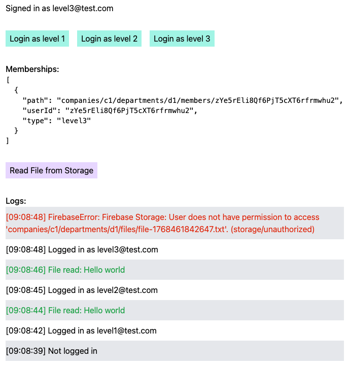

# Firebase Storage Permissions Bug

This project highlights a bug in the Firebase Storage Rules system, where the permissions are not correctly checked. It is deployed on [fb-storage-permissions.web.app](https://fb-storage-permissions.web.app/).

## The setup

There is a file stored at `/companies/c1/departments/d1/files/file-1768461842647.txt` in Firebase Storage. The access rules in this repository are deployed on firebase (minus the read rights, but these are not necessary for the demo). Interesting are the [storage.rules](./storage.rules), where the access is managed for three different levels of users.

The web app lets the user sign in for different levels and read the file described above. All users have the necessary rights to read the file.

### Steps for local setup

1. Install dependencies using `pnpm install`
1. Create a new firebase project and adjust the config in [firebase.ts](./src/firebase.ts)
1. Allow cors for Firebase Storage
1. Run the project using `pnpm dev`
1. Uncomment the two buttons in [App.tsx](./src/App.tsx) and import the necessary functions from [lib.ts](./src/lib.ts) to create the users and upload the file to the correct location

## The bug

**When testing the rules in the Firebase Console, all users are allowed to access the file (which is expected)**. But when testing using the deployed webapp, the level 3 user cannot access the file. It seems as if only the first two checks are made and the third one (which checks access for level3 users) is not (correctly) executed. For reference, here the relevant part of the rules:

```
match /b/{bucket}/o {
  match /{allPaths=**} {
    allow read: if isLevel1();
  }

  match /companies/{companyId} {
    match /{allPaths=**} {
      allow read: if isLevel2(companyId);
    }

    match /departments/{departmentId} {
      match /{allPaths=**} {
        allow read: if isLevel3(companyId, departmentId);
      }
    }
  }
}
```

Interesting is, **it is always the third check that is not executed (or fails)**. When the rules are changed to the following, level3 can access the file but level2 no longer can:

```
match /b/{bucket}/o {
  match /{allPaths=**} {
    allow read: if isLevel1();
  }

  match /companies/{companyId} {
    match /departments/{departmentId} {
      match /{allPaths=**} {
        allow read: if isLevel3(companyId, departmentId);
      }
    }

    match /{allPaths=**} {
      allow read: if isLevel2(companyId);
    }
  }
}
```

Here is a screenshot of a test run, see the logs for the performed actions (the most recent log is at the top):



## Why should you fix this?

This exact setup works fine in Firebase Firestore. It makes access control for larger (encapsulated) apps very easy, but when only the first two checks are executed, it is not usable. I cannot use Firebase Storage when this does not work, since the users cannot download the files... And since it works for Firestore, I suppose it is intended to also work for Storage.
